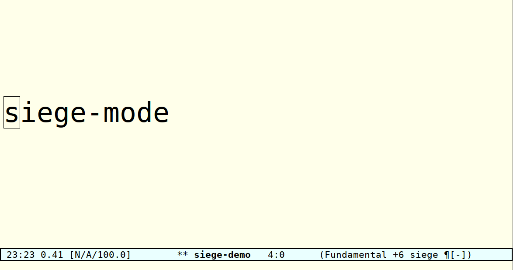

# siege-mode
An emacs minor mode to surround the region with smart delimiters interactively.

## Lay siege to the region from both sides!
#### (with the power of regular expressions)

When the region is active, most input¹ is redirected to the minibuffer and
treated as a delimiter for the region. The input is used as the left delimiter
from which the right one is derived using `siege-transform-regexs` applied to
tokens generated by `siege-boundary-list' and `siege-block-*`. If such
derivations are not desired they may be disabled via "C-c a" in the minibuffer
or by default (`siege-default-derive`). This process may be explicitly invoked
by calling `siege-explicit-call`, bound to "M-s M-s".

All changes are dynamically displayed in the buffer (see `siege-preview-face`)
and may be committed by "Ret" in the minibuffer. It is also possible to commit
the input on "space" as set by `siege-default-end-on-space` and toggled by 
"C-c s" in the minibuffer.

By default siege-mode understands the usual delimeter pairs, as well as latex
LaTeX begin/end pairs and left/right pairs. Moreover, for ease of use it will
pair both `_{` and `^{` with `}` by default.

## License

GPL v3+

## Technical note

¹ siege-mode remaps `self-insert-command` so that key-presses which would
otherwise simply insert a character trigger delimiter input. This would seem to
be the best compromise between usability and unobtrusiveness, but the author is
certainly open to suggestion.
